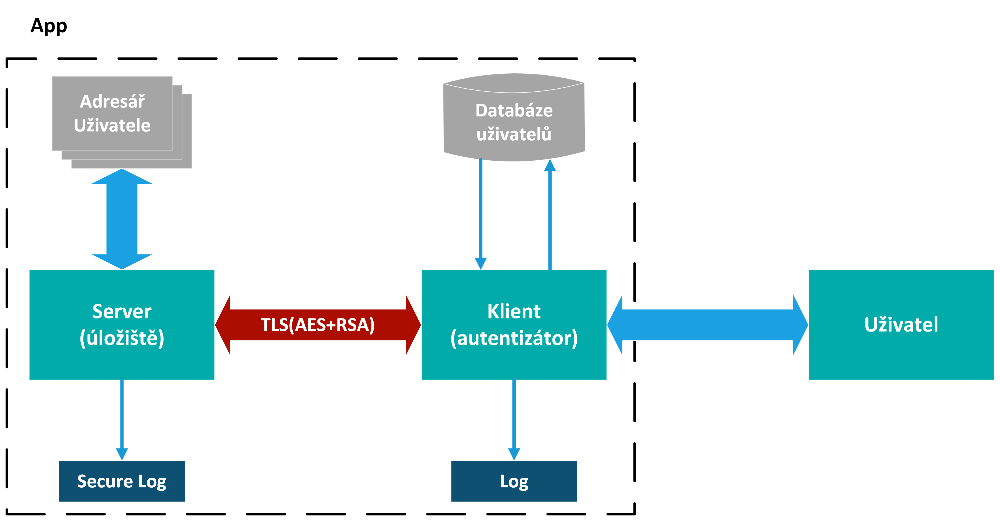

# Projekt: Zabezpečené úložiště
Autoři: Vilém Pecháček, Radim Macho
## Obsah

- [Cíle](#cíle)
- [Úvod](#úvod)
- [Instalace](#instalace)
- [Problematika](#problematika)
- [Vývojový diagram autentizátoru](#vývojový-diagram-autentizátoru)
- [Vývojový diagram serveru](#vývojový-diagram-serveru)
- [Kryptografická ochrana](#kryptografická-ochrana)
- [Funkce serveru](#funkce-serveru)
- [Funkce klienta](#funkce-klienta)
- [DoS ochrana](#dos-ochrana)
- [Závěr](#závěr)
- [Literatura](#literatura)

## Cíle

Navrhněte a naprogramujte úložiště dat, které bude zabezpečeno pomocí kryptografických algoritmů. Pro přístup k uloženým datům bude vyžadována dvoufaktorová autentizace uživatele. Uživatel se bude moci autentizovat s využitím algoritmů symetrické a asymetrické kryptografie. Při stahování souborů z úložiště ku živateli (při nahrávání souborů od uživatele na úložiště) bude zajištěna důvěrnost přenášených dat. Úložiště bude vytvářet logy o přístupu a akcích uživatele (kdy byl autentizován, jaké soubory četl, změnil, smazal, kopíroval, stahoval apod.). Logy o přístupu a akcích uživatele budou chráněny proti jejich čtení a změně. Navrhněte způsob ochrany úložiště proti DoS (Denial of Service) útokům.

## Úvod

Tento projekt implementuje zabezpečené úložiště dat s řízeným přístupem a dvoufázovým ověřením (2FA). Uživatel se přihlašuje prostřednictvím klientské aplikace (autentizátoru) pomocí hesla a jednorázového kódu (TOTP) generovaného v aplikaci Google Authenticator. Po úspěšné autentizaci se naváže spojení se serverem, kde jsou data bezpečně uložena. Veškeré akce uživatele na klientovi i serveru se zaznamenávají do chráněných logů. Přenos dat mezi klientem a serverem (nahrávání i stahování) je šifrován pomocí AES, což zajišťuje jejich důvěrnost.

## Instalace

### Požadavky:
+ Python 3.13.2 [link](https://www.python.org/downloads/release/python-3132/)
+ Linux (Ubuntu, Debian, ...)
+ Google Authenticator App

### Kroky:
1. Vytvoření virtuálního prostředí
```bash  
python3 -m venv venv
``` 
2. Aktivování venv
```bash  
source ./venv/bin/activate
```
3. Instalace knihoven
```bash
pip install -r requirements.txt
```
### Spuštění programu:
1. Spuštění Serveru
```bash
python3 server.py
```
2. Spuštění klienta (programu)
```bash
python3 client.py
```

## Problematika

Se stále větším využíváním digitálních technologií v každodenním životě se otázka kybernetické bezpečnosti stala klíčovou součástí ochrany osobních a firemních dat. Podle zprávy společnosti IBM[1] (2023) se průměrná cena úniku dat v roce 2022 pohybovala okolo 4,35 milionů dolarů na organizaci, přičemž až 82 % těchto incidentů souviselo s neoprávněným přístupem k uživatelským účtům. Bezpečné ověřování uživatelů je proto zásadní pro ochranu citlivých informací [1].

### Autentizace a dvojfázové ověřování
Nejčastějším způsobem autentizace jsou stále tradiční ověřovací metody, jako hesla. Nicméně kvůli špatným bezpečnostním návykům uživatelů (používání slabých hesel nebo jejich opakované použití apod.) dochází k četným únikům dat. Dvoufázové ověřování (2FA) se proto stává standardem pro posílení bezpečnosti přihlašovacích mechanismů [2].
Autentizace je proces ověření identity uživatele na základě něčeho, co zná (heslo), něčeho, co vlastní (mobilní zařízení, token apod.), nebo něčeho, čím je (biometrické údaje) [3]. 2FA je metoda, která kombinuje dvě z těchto kategorií, čímž výrazně zvyšuje bezpečnost přihlášení [4].
Často používanou formou 2FA je TOTP (Time-Base One-Time Passwords), což jsou jednorázové kódy generované na základě času a sdíleného tajného klíče mezi serverem a uživatelem. Tento mechanismus je široce podporován aplikacemi jako Google Authenticator nebo Authy. Hlavní výhodou TOTP oproti SMS autentizaci je vyšší odolnost vůči phishingovým útokům a zachycení přihlašovacích údajů [5].

#### Proces TOTP:
1.	Server a uživatel vygenerují sdílený klíč
2.	Tento klíč je uložen v autentizační aplikaci na zařízení uživatele
3.	Při přihlášení server i aplikace synchronizovaně generují časově omezený jednorázový kód
4.	Uživatel zadá tento kód a server ověří jeho správnost
Tímto způsobem je možné snížit riziko kompromitace hesel, protože i v případě úniku přihlašovacích údajů je stále vyžadován další ověřovací faktor, který útočník nemá [6].

### Ochrana dat
Zabezpečení přenosu dat v síti je stěžejním úkolem ochrany citlivých informací před neoprávněným přístupem a útoky na důvěrnost. Bezpečnosti se v praxi dosahuje vrstvenou ochranou, která zahrnuje šifrování dat a certifikaci komunikujících stran [7].
 Mezi bezpečné protokoly pro přenos dat patří např. Secure File Transfer Protocol (SFTP). Tento protokol využívá kryptografii Secure Shell (SSH) k šifrování dat. SFTP podporuje autentizaci na základě hostitele a využívá párové klíče. Další variantou je File Transfer Protocol Over SSL (FTPS), který je rozšířením FTP o podporu Tansport Layer Security (TLS). FTPS však vyžaduje použití dvou portů na klientském serveru, což může komplikovat přenosy dat přes firewally [8].
Dalším široce používaným protokolem je Hypertext Transfer Protocol Secure (HTTPS). Jedná se o rozšíření protokolu HTTP, které využívá šifrování pomocí protokolu TLS k zabezpečení komunikace mezi webovým prohlížečem a webovou stránkou. HTTPS je standardem a každá bezpečná webová stránka by jej měla implementovat, zejména pokud požaduje zadávání citlivých údajů uživatelů [8].



## Vývojový diagram autentizátoru

Architektura aplikace je postavena na principu klient-server, kdy klient je autentizátor a server pak samotné úložiště dat. Úkolem autentizátoru je ověřit identitu uživatele, a následně vybudovat zabezpečené spojení pro přenos souborů mezi serverem a uživatelem. Autentizace uživatele probíhá pomocí dvoufázového ověření, kdy je uživatel vyzván k zadání hesla a TOTP kódu. Přihlašovací údaje uživatelů jsou uloženy v SQL databázi, heslo je před vložením do databáze zahešováno. Blokové schéma aplikace je zobrazeno na obrázku výše.

Po úspěšné autentizaci uživatele naváže klient spojení se serverem, kdy nejprve klient předá uživatelovo jméno a svůj veřejný klíč. Server použije jméno uživatele pro otevření správného adresáře a uloží si veřejný klíč klienta. V případě nahrávání či stahování souborů ze serveru je použito symetrického šifrování AES s ohlašováním klíčů pomocí RSA. Způsob zajištění důvěrnosti souborů pro oba směry je popsán níže. Server běží na frameworku Flask.


## Vývojový diagram serveru

Při prvotním spuštění serveru si server vygeneruje své RSA klíče, kdy veřejný klíč bude zveřejněn na daném endpointu. Server si také načte svůj certifikát, který si bude při každém požadavku klient ověřovat. Po úšpěšném přihlášení uživatele na straně autentizátoru se klient serveru ohlásí předáním svého veřejného klíče pro přípádný budoucí přenos souborů. Každá další žádost musí ve své hlavičce obsahovat uživatelské jméno klienta, který přes autentizátor vystupuje. Podle tohoto jména bude server provádět požadavky nad správným adresářem. Server následně funguje klasickým způsobem, kdy API naslouchá na daných endpointech. V případě požadavku pak z žádosti extrahuje hlavičku s uživatelským jménem, a v případě, že uživatel nepřekročil daný počet požadavků za minutu (viz kapitola [níže](#dos-ochrana)) provede daný požadavek (které jsou podrobně popsány [níže](#funkce-serveru)). Server v rámci požadavku také ověřuje, jestli adresář uživatele existuje. Pokud ne, tak ho vytvoří. V případě úspěch pak JSON odpověď obsahuje OK kód typu 2xx, v opačném případě pak server ohlásí chybu kódem 4xx. Veškeré žádosti, které nějakým způsobem manipulují se soubory jsou pak logovány do chráněného logu serveru.


## Kryptografická ochrana

Aplikace implementuje asymetrické a symetrické kryptosystémy k ochraně důvěrnosti přenášených dat a ohlášení klíčů a zabezpečení jejich autentičnosti. Komunikace mezi klientem a serverem je zabezpečena pomocí TLS, kdy server je držitelem certifikátu, který je klientem ověřován při každé žádosti. Veškerá komunikace mezi serverem a klientem začíná TLS handshakem, kteý lze zaznamenat např. pomocí programu wireshark.


Pokud dochází k přenášení souborů (stahování nebo nahrávání), jsou soubory ještě dodatečně zašifrovány pomocí AES, jehož klíče si klient a server ohlasí pomocí RSA. Bezpečnost v projektu tedy funguje na principu hybridní kryptografie, kdy symetrická kryptografie (AES) je použita pro samotný přenos dat a asymetrická kryptografie (RSA) pro bezpečné sdílení klíče. Níže je detailní popis tohoto procesu:

### Proces nahrávání souboru (upload.py)
1.	Klient vygeneruje AES-256 klíč.
2.	Pomocí tohoto klíče zašifruje soubor AES v CBC módu.
3.	Získá veřejný klíč serveru přes API (/public-key).
4.	RSA (PKCS1_OAEP) zašifruje AES klíč pomocí veřejného klíče serveru.
5.	Odesílá zašifrovaný soubor, zašifrovaný AES klíč a IV na server (/upload).

### Proces zpracování nahraného souboru (server.py)
1.	Server přijme zašifrovaný soubor, zašifrovaný AES klíč a IV.
2.	RSA (PKCS1_OAEP) dešifruje AES klíč pomocí privátního klíče serveru.
3.	Použije AES-256 v CBC módu k dešifrování souboru.
4.	Uloží soubor v dešifrované podobě na disk.
 
### Proces stahování souboru (download.py)
1.	Klient požádá server o soubor (/get-file).
2.	Server vygeneruje nový AES-256 klíč.
3.	Pomocí AES zašifruje soubor CBC módem.
4.	Načte veřejný klíč klienta (client_public_key.pem).
5.	Pomocí RSA (PKCS1_OAEP) zašifruje AES klíč veřejným klíčem klienta.
6.	Pošle zašifrovaný soubor, zašifrovaný AES klíč a IV klientovi.

## Logování

Logování programu je uloženo v adresáři logs a slouží k:

- záznamu důležitých událostí (např. vytvoření souboru, přihlášení, šifrování)

- odhalování chyb a ladění systému

- ověřování integrity logů pomocí hashování

Logování probíhá odděleně na klientské straně a serverové straně, kdy na klientské straně (client_log.txt) je do logu zapisováno v úrovních důležitosti INFO, WARNING, ERROR, CRITICAL doplněné o časovou známku. Klientský log zaznamenává všechny pokusy o přihlášení, úspěšné přihlášení, taktéž dotazy a odpovědi serveru. Klientský log není chráněn proti nedovolené editaci.

Serverový log (secure_server_log.txt) zaznamenává pouze manipulaci se soubory, které přihlášený uživatel provede. Navíc je chráněn proti nedovolené editaci pomocí vlastního zabezpečeného loggeru SecureClientLogger. Ten při každém záznamu počítá hash každého logovaného záznamu a kontroluje integritu logu (řetěz hashů). Postup zabezpečeného loggování:

1. Načtení posledního hashe
2. Spočítaní hashe aktuální zprávy s předchozím hashem
3. Výsledek se uloží vedle zprávy
4. Před zápisem se kontroluje integrita všech předchozích záznamů
5. Při zjištění nekonzistence se logování přeruší a zapíše se chybové hlášení

## Funkce serveru

Server poskytuje sadu REST API endpointů pro manipulaci se soubory a složkami v rámci adresáře jednotlivých uživatelů. Každá funkce vyžaduje autentizaci pomocí hlavičky `X-Username`.

---

### Seznam funkcí

#### `create_file`
- **Metoda:** `POST`
- **URL:** `/create-file`
- **Popis:** Vytvoří nový soubor s volitelným obsahem v rámci adresáře přihlášeného uživatele.
- **Parametry:**
  - `filename` (string) – relativní cesta a název souboru
  - `content` (string) – obsah souboru (volitelné)
- **Odpověď:** JSON zpráva o úspěchu a výsledná absolutní cesta na serveru.

---

#### `delete_file`
- **Metoda:** `POST`
- **URL:** `/delete-file`
- **Popis:** Smaže zadaný soubor v rámci adresáře přihlášeného uživatele.
- **Parametry:**
  - `filename` (string) – relativní cesta a název souboru
- **Odpověď:** JSON zpráva o úspěchu.

---

#### `edit_file`
- **Metoda:** `POST`
- **URL:** `/edit-file`
- **Popis:** Přepíše obsah existujícího souboru.
- **Parametry:**
  - `filename` (string) – relativní cesta a název souboru
  - `content` (string) – nový obsah souboru
- **Odpověď:** JSON zpráva o úspěchu.

---

#### `create_directory`
- **Metoda:** `POST`
- **URL:** `/create-directory`
- **Popis:** Vytvoří nový adresář v rámci adresáře přihlášeného uživatele.
- **Parametry:**
  - `dirname` (string) – relativní cesta a název složky
- **Odpověď:** JSON zpráva o úspěchu a výsledná absolutní cesta na serveru.

---

#### `delete_directory`
- **Metoda:** `POST`
- **URL:** `/delete-directory`
- **Popis:** Smaže zadaný adresář včetně jeho obsahu.
- **Parametry:**
  - `dirname` (string) – relativní cesta a název složky
- **Odpověď:** JSON zpráva o úspěchu.

---

#### `rename`
- **Metoda:** `POST`
- **URL:** `/rename`
- **Popis:** Přejmenuje soubor nebo adresář.
- **Parametry:**
  - `old_name` (string) – původní relativní cesta a název
  - `new_name` (string) – nový relativní název
- **Odpověď:** JSON zpráva o úspěchu, původní a nová absolutní cesta na serveru.

---

#### `list_dir`
- **Metoda:** `GET`
- **URL:** `/list-dir`
- **Popis:** Vrátí seznam položek (složek a souborů) v zadaném adresáři uživatele.
- **Parametry:**
  - `path` (string, volitelné) – relativní cesta k adresáři, výchozí je root
- **Odpověď:** JSON seznam objektů s názvem a typem (`file`, `directory`, `other`).

---

#### `read_file`
- **Metoda:** `GET`
- **URL:** `/read-file`
- **Popis:** Vrátí obsah textového souboru.
- **Parametry:**
  - `file_path` (string) – relativní cesta a název souboru
- **Odpověď:** JSON obsah souboru.

---

#### `check_directory`
- **Metoda:** `GET`
- **URL:** `/check-directory`
- **Popis:** Ověří, zda zadaný adresář existuje.
- **Parametry:**
  - `path` (string) – relativní cesta k adresáři
- **Odpověď:** JSON s boolean hodnotou `exists`.

---

### Bezpečnostní omezení
Každá funkce kontroluje platnost cesty pomocí `is_safe_path`, která ověřuje, že cílová cesta leží v rámci vyhrazeného adresáře přihlášeného uživatele Operace jsou autorizovány pomocí hlavičky `X-Username`. Všechny operace jsou logovány do zabezpečeného logovacího systému na serveru.

## Funkce klienta

Klientská část systému poskytuje sadu příkazů pro práci se vzdáleným serverem a správu souborů v rámci uživatelského adresáře na serveru. Kromě funkcí volajících API serveru obsahuje klient i pomocné lokální funkce pro zpracování vstupu a zobrazení nápovědy.

---

### Seznam funkcí

#### `touch` — Vytvoření souboru
- Volá: `POST /create-file`
- Vytvoří nový soubor s volitelným obsahem na serveru.

#### `edit` — Úprava souboru
- Volá: `POST /edit-file`
- Přepíše obsah existujícího souboru.

#### `rmf` — Smazání souboru
- Volá: `POST /delete-file`
- Smaže zadaný soubor.

#### `mkdir` — Vytvoření adresáře
- Volá: `POST /create-directory`
- Vytvoří nový adresář.

#### `rmd` — Smazání adresáře
- Volá: `POST /delete-directory`
- Smaže zadaný adresář včetně jeho obsahu.

#### `rename` — Přejmenování souboru nebo složky
- Volá: `POST /rename`
- Přejmenuje soubor nebo adresář.

#### `down` — Stažení souboru
- Volá: `GET /get-file`
- Stáhne zašifrovaný soubor ze serveru a dešifruje ho na klientovi.

#### `up` — Nahrání souboru
- Volá: `POST /upload`
- Zašifruje a odešle soubor na server.

#### `ls` — Výpis obsahu adresáře
- Volá: `GET /list-dir`
- Vrátí seznam souborů a složek v aktuálním adresáři na serveru.

#### `read` — Čtení obsahu souboru
- Volá: `GET /read-file`
- Vrátí obsah textového souboru.

#### `cd` — Změna adresáře
- Volá: `GET /check-directory`
- Ověří existenci adresáře na serveru a změní aktuální pracovní adresář na klientovi.

#### `exit` — Ukončení aplikace
- Ukončí běh klientské aplikace.

#### `help` — Výpis nápovědy
- Vypíše seznam dostupných příkazů a jejich popis.

#### `show_menu` — Vykreslení menu příkazů
- Interní funkce klienta pro vypsání všech dostupných příkazů na terminál.

#### `input_list` — Zpracování vstupu uživatele
- Pomocná funkce pro mapování zkrácených a alternativních vstupů na odpovídající příkazy.

---

### Shrnutí

| Příkaz  | Funkce klienta       | API serveru / klient |
|:---------|:-----------------------|:-----------------------|
| `touch`   | `create_file`            | `POST /create-file`      |
| `edit`    | `edit_file`              | `POST /edit-file`        |
| `rmf`     | `delete_file`            | `POST /delete-file`      |
| `mkdir`   | `create_directory`       | `POST /create-directory` |
| `rmd`     | `delete_directory`       | `POST /delete-directory` |
| `rename`  | `rename`                 | `POST /rename`           |
| `down`    | `download_file`          | `GET /get-file`          |
| `up`      | `upload_file`            | `POST /upload`           |
| `ls`      | `list_directory`         | `GET /list-dir`          |
| `read`    | `read_file`              | `GET /read-file`         |
| `cd`      | `change_directory`       | `GET /check-directory` + klient změna cwd |
| `exit`    | `exit`                   | klient                  |
| `help`    | `help`                   | klient                  |
| `show_menu` | `show_menu`            | klient                  |
| `input_list`| `input_list`           | klient                  |

---

## DoS ochrana

Cílem DoS ochrany je chránit server proti zneužití nadměrným počtem operací (upload/download, file operace, atd.). K tomuto účelu jsme použili knihovnu Flask-Limiter, což je rozšíření Flasku pro rate limiting. Každý příchozí request na omezený endpoint je kontrolován. Pokud klient překročí limit, server automaticky vrátí HTTP odpověď: 429 Too Many Requests. Momentální omezení pro jakýkoliv požadavek je 5 výskytů za minutu. Výhoda tohoto řešení je jeho jednoduchost a rychlá ochrana proti DoS útokům, není potřeba žádné externí proxy nebo WAF a je tu možnost detailně nastavit limity pro různé operace.

## Závěr

V rámci projektu byly splněny všechny cíle zadání. Byla implementována kompletní dvoufázová autentizace uživatele, kdy se uživatel musí nejprve zaregistrovat, uložit své heslo a pomocí aplikace Google Authenticator nasnímat QR kód generovaný autentizátorem pro uložení TOTP klíče. Uživatel je po úspěšné registraci uložen v databázi klienta, která obsahuje jeho uživatelské jméno, zahešované heslo a TOTP secret. Při každém přihlašování je následně po uživateli vyžadováno heslo a TOTP kód, který je časově generován ve zmíněné aplikaci Google Authenticator. Dále byl implementován server, který vlastní certifikát a veškerý přenos mezi klientem a serverem je pomocí něj šifrován TLS. Přenos souborů je navíc šifrován pomocí AES, kdy potřebné klíče si protistrany ohlásí pomocí RSA. Své klíče si každá strana generuje sama. Tímto způsobem je zabezpečena důvěrnost přenášených souborů, a díky TLS je zajištěno bezpečné předání klíčů. Logování záznamů si klient i server řeší samostatně. Na straně klienta jsou logovány veškeré akce, jako pokusy o přihlášení, požadavky nebo přenosy souborů. Na straně serveru jsou logovány pouze požadavky, které manipulují se soubory v adresáři uživatele. Záznamy jsou navíc zabezpečeny proti přepisování pomocí výpočtu hashů jednotlivých záznamů. Tímto způsobem je zajištěna integrita logu. Server také obsahuje ochranu proti DoS útokům, a to pomocí omezeného počtu obsloužených požadavků za minutu. V případě překročení server další požadavek odmítne.

## Literatura

[1] IBM. Cost of a Data Breach Report 2024. Online. 2024. Dostupné z: https://www.ibm.com/reports/data-breach. 

[2] BONNEAU, Joseph; HERLEY, Cormac; OORSCHOT, Paul C. van a STAJANO, Frank. The Quest to Replace Passwords: A Framework for Comparative Evaluation of Web Authentication Schemes. Online. In: 2012 IEEE Symposium on Security and Privacy. IEEE, 2012, s. 553-567. ISBN 978-1-4673-1244-8. Dostupné z: https://doi.org/10.1109/SP.2012.44.

[3] GRASSI, P. A.; GARCIA, M. E.; FENTON, J. L. Digital Identity Guidelines, National Institute of Standards and Technology. NIST Special Publication, 2021, 800-63.

[4] DAS, Anupam, et al. The tangled web of password reuse. In: NDSS. 2014. p. 23-26.

[5] Google Security Blog. (2018). The case for security keys. Google.

[6] Mannan, M., & Van Oorschot, P. C. (2008). Passwords for both users and security administrators. IEEE Internet Computing.

[7]	MICROSOFT. What is data security? [online]. [cit. 2025-03-14]. Dostupné z: https://www.microsoft.com/cs-cz/security/business/security-101/what-is-data-security

[8]	BAKOTECH. Maximalizace zabezpečení při přenosu souborů: nejlepší šifrovací postupy [online]. [cit. 2025-03-14]. Dostupné z: https://www.bakotech.cz/news/maximalizace-zabezpeceni-pri-prenosu-souboru-nejlepsi-sifrovaci-postupy

